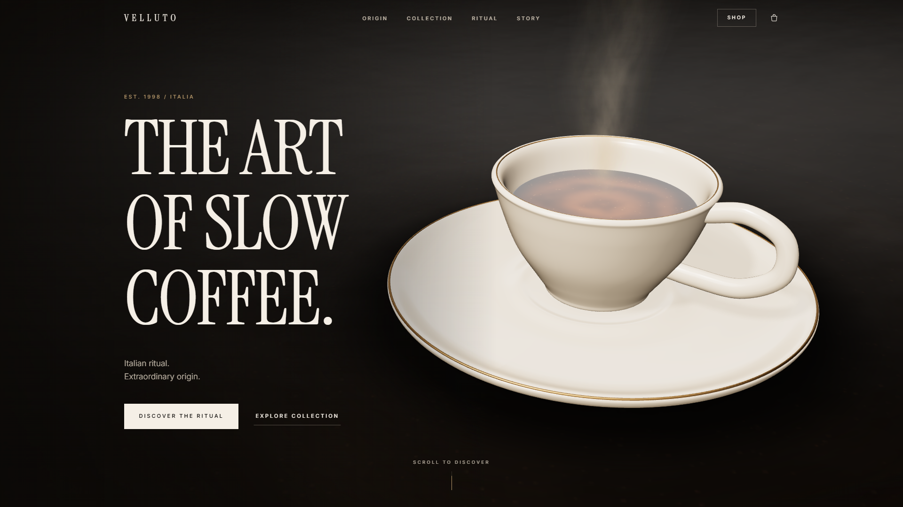
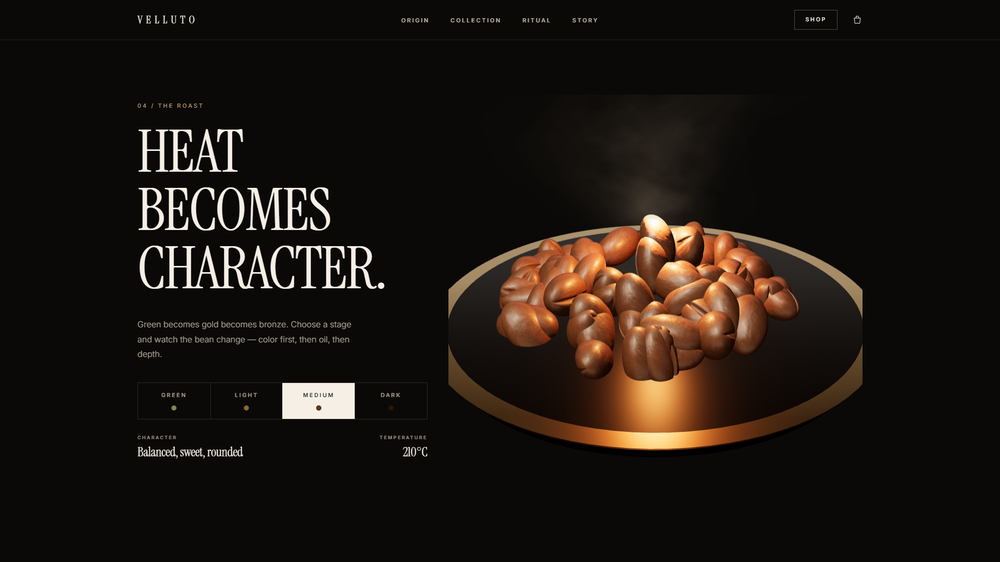
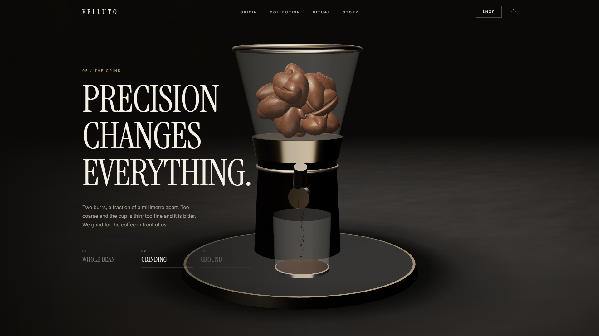
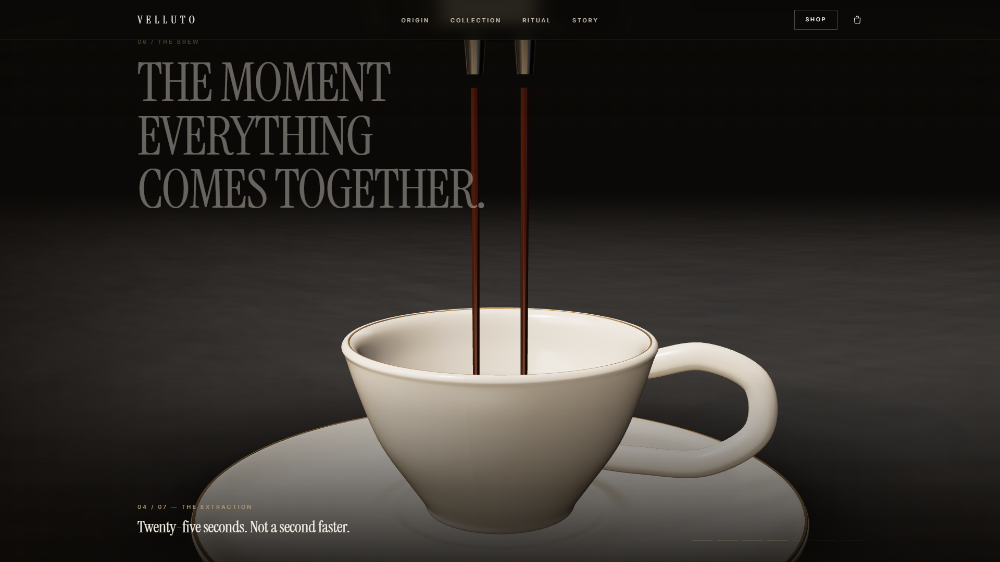
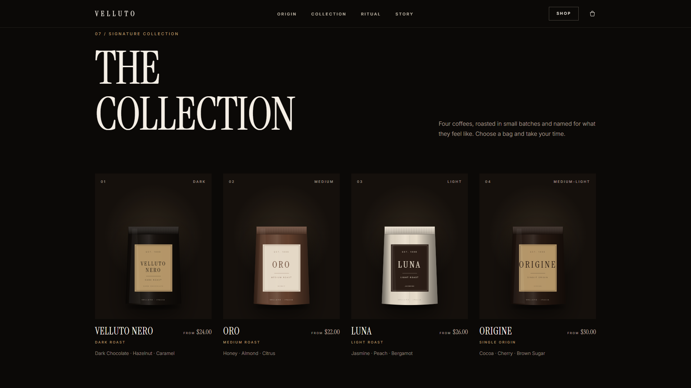

# VELLUTO — The Art of Slow Coffee

A cinematic, futuristic coffee-brand website **template**. A realistic 3D espresso cup with a scroll-driven camera
that dives into the crema, an interactive origin map, a fully 3D bean → roast → grind → brew sequence, a working
frontend shop (cart, product viewer, checkout demo), and an editorial layout — all built to be re-skinned into any
coffee brand from a handful of data files.

**Live demo:** https://velluto-muad1.vercel.app
**Get the source:** https://muadme.gumroad.com/l/ydqpk

## Highlights

- **Fully procedural 3D** — the espresso cup, coffee beans, roaster tray, grinder and brew rig are all built from
  geometry and canvas-generated textures. No external 3D models, no Sketchfab, no stock assets to license.
- **Seven scroll-pinned scenes** — hero, origin map, bean macro, roast (4 stages), grinder, brew (7-beat pour), and
  the product collection — the camera and scene state are driven by native scroll, nothing is scroll-jacked.
- **Adaptive quality** — device tier is detected (desktop / modern phone / weak hardware) and the render quality,
  particle counts, shadows and pixel ratio scale accordingly; weak devices and `prefers-reduced-motion` get
  pre-rendered stills instead of live WebGL, so nothing ever looks broken.
- **A real frontend shop** — product viewer, cart drawer, checkout demo, all wired with Zustand state.
- **Everything brandable lives in a few data files** — name, colors, products, origins, story timeline and copy are
  all separated from the components.

## Stack

React 19 · TypeScript · Vite · Tailwind CSS v4 · three.js / React Three Fiber · Framer Motion · GSAP · Zustand

## Gallery

| | |
|---|---|
|  |  |
|  |  |

## This repository

This repo is a **showcase** — screenshots and a live demo link, not the source. The full source (with setup docs,
the re-skinning guide, and the image-regeneration scripts) is the deliverable sold on Gumroad:
**https://muadme.gumroad.com/l/ydqpk**

## More templates

- [AURELIA](https://github.com/Muaddd1/AURELIA) — luxury e-commerce React template ([demo](https://aurelia-template-phi.vercel.app))
- [VANTA](https://github.com/Muaddd1/VANTA) — premium digital-product storefront ([demo](https://vanta-creator-os.vercel.app))
- [AURUM](https://github.com/Muaddd1/AURUM) — luxury gold jewelry template with a live gold price calculator and Arabic RTL ([demo](https://aurum-template-muad1.vercel.app))
- [GOLDEN CRUST](https://github.com/Muaddd1/GOLDEN-CRUST) — pizza restaurant template with a 3D pizza hero ([demo](https://golden-crust-muad1.vercel.app))
